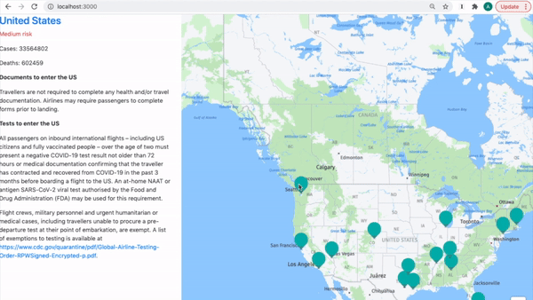

## Covid-19 Travel Restrictions 

In this prototype built with Node and Express.js we demonstrate Travel Restrictions for USA displayed on a map. We use the following APIs: 
- [Travel Restrictions](https://developers.amadeus.com/self-service/category/hotel/api-doc/hotel-search): returns Travel Restrictions
- [HERE Maps for JavaScript](https://developer.here.com/): displays a map with markers and text bubbles




## How to run the project locally

Clone the repository.

```sh
git clone https://github.com/amadeus4dev/amadeus-travel-restrictions-node.git
cd amadeus-travel-restrictions-node
```

Install the dependancies

```
npm install
```

For authentication add your API key/secret to your environmental variables.

```sh
export AMADEUS_CLIENT_ID=YOUR_API_KEY
export AMADEUS_CLIENT_SECRET=YOUR_API_SECRET
export HERE_API_KEY=YOUR_HERE_API_KEY
```

You can easily switch between `test` and `production` Amadeus environments by setting:

```
export AMADEUS_HOSTNAME="test" # an empty value will also set the environment to test
```

or

```
export AMADEUS_HOSTNAME="production"
```

> Each environment has different API keys. Do not forget to update them!

Finally, run the Node server.

```sh
node app.js
```

Finally, open a browser and go to `http://localhost:3000/`.

## License

This library is released under the [MIT License](LICENSE).

## Help

Our [developer support team](https://developers.amadeus.com/support) is here
to help you. You can find us on
[StackOverflow](https://stackoverflow.com/questions/tagged/amadeus) and
[email](mailto:developers@amadeus.com).
